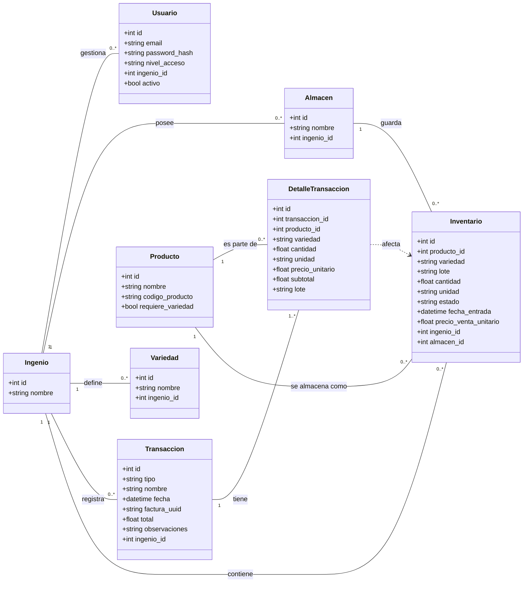

# Diagrama de la Base de Datos - Sistema Arroz

Este documento contiene el diagrama de clases de la base de datos en formato Mermaid.
Puedes visualizarlo usando una extensión de Markdown compatible con Mermaid en tu editor (como en VS Code) o pegando el código en un editor en línea como [Mermaid Live](https://mermaid.live).

### Explicación de las Relaciones

*   **`Ingenio`**: Es la entidad central. Un ingenio tiene múltiples `Usuarios`, `Almacenes`, `Variedades`, `Transacciones` e `Inventario`.
*   **`Transaccion`**: Representa cualquier operación (compra, venta, etc.). Cada transacción tiene uno o más `DetalleTransaccion`.
*   **`DetalleTransaccion`**: Contiene los ítems específicos de una transacción, como qué `Producto` se movió, la cantidad y el precio.
*   **`Inventario`**: Representa el stock físico. Cada entrada en el inventario corresponde a un `Producto` y está ubicada en un `Almacen`.
*   **`DetalleTransaccion ..> Inventario`**: La línea punteada indica una relación lógica. Una transacción (a través de sus detalles) *afecta* al inventario (aumentando o disminuyendo el stock), aunque no haya una clave foránea directa entre estas dos tablas.
